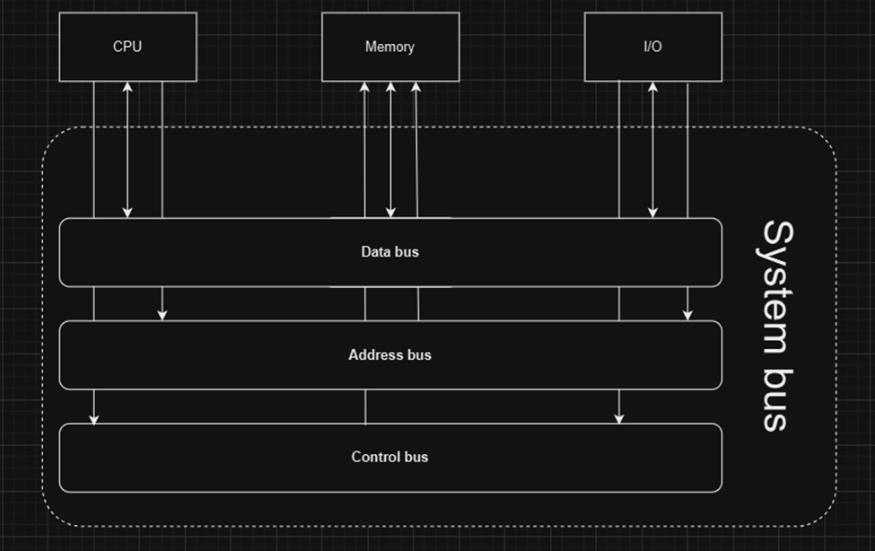

# Các công việc cần làm

## Các kiến thức cần chuẩn bị
### Kiến thức phần cứng máy tính
1. Nghiên cứu phần cứng máy tính
• Máy tính tiếp nhận dữ liệu đầu vào, lưu trữ, xử lý dữ liệu sau đó hiển thị/đầu ra.
• Thiết bị đầu vào: bàn phím, bàn di chuột, chuột, micrô, v.v.
• Thiết bị đầu ra: màn hình, loa, v.v.
• Vỏ máy tính bên ngoài: Mặt trước: Cổng USB, cổng tai nghe & micrô, ODD (để cắm CD). Mặt sau: Nguồn điện (cắm dây vào và nhấn nút ‘bắt đầu’ để bật máy tính), card chuyển đổi (các thành phần bổ sung chức năng mới cho máy tính. Ví dụ: mạng, đồ họa, âm thanh, lưu trữ, v.v.), các cổng khác (HDMI để kết nối máy tính với màn hình, giắc cắm âm thanh cho tai nghe & micrô & loa).
• Vỏ máy tính bên trong: quạt tản nhiệt (cho CPU), CPU (xử lý thông tin), RAM/thẻ nhớ (lưu trữ thông tin tạm thời), ổ cứng/ổ đĩa thể rắn (lưu trữ dữ liệu của người dùng), ROM (lưu trữ hướng dẫn khởi động và chỉ đọc), v.v.
• CPU: ALU (thực hiện các phép tính số học (+-x:) & logic (AND, OR, NOT)), bộ điều khiển (giải mã và kiểm soát việc phân phối hướng dẫn, cái nào thực hiện trước…sau), thanh ghi (tạm thời truy xuất dữ liệu cho ALU và CPU nói chung để truy cập nhanh), BUS (hoạt động như một đường dẫn để truyền dữ liệu trong/giữa các máy tính/dây + tín hiệu điều khiển)
• Thanh ghi: PC (Bộ đếm chương trình: đếm lên bất cứ khi nào một hướng dẫn được thực hiện bằng cách giữ địa chỉ của lệnh tiếp theo), IR (Thanh ghi lệnh giữ lệnh đang được thực thi), MAR (Thanh ghi địa chỉ bộ nhớ: lưu trữ địa chỉ (nơi lệnh đến, nơi lệnh sẽ đến) của lệnh cho đến khi lệnh được thực thi), SP (Con trỏ ngăn xếp: trỏ đến đầu ngăn xếp (hoạt động như một chồng giấy))
• Thêm về ngăn xếp: PUSH (thêm vào chồng giấy), POP (xóa khỏi ngăn xếp và bạn chỉ có thể xóa phần đầu tiên)  FILO (vào trước ra sau, phần tử đầu tiên trong ngăn xếp là phần tử cuối cùng rời khỏi và ngược lại).
• Bộ điều khiển: Có thể lập trình vi mô (Sử dụng các lệnh vi mô  Linh hoạt hơn vì mã có thể được cập nhật thuận tiện + lệnh tra cứu chậm), Có dây cứng (Mọi thứ đều được kết nối vật lý  Nhanh hơn vì lệnh có dây, không cần tra cứu + Ít linh hoạt hơn vì có nhiều dây hơn)
• Bộ nhớ: 8 bit = 1 byte; 1KB = 1024B  1MB=1024KB GB TB PB EBZBYB.
• Bộ nhớ (tiếp theo): Bộ nhớ đệm (nằm giữa CPU và RAM, lưu trữ dữ liệu thường xuyên truy cập từ RAM để CPU có thể hoạt động nhanh hơn), RAM (bộ nhớ chính, lưu trữ dữ liệu tạm thời để truy cập nhanh, có thể đọc và ghi dữ liệu, dễ bay hơi), D-RAM & S-RAM (bộ nhớ trước cần được làm mới trong khi bộ nhớ sau có thể duy trì trạng thái miễn là bật nguồn).
• Bộ nhớ (next2): ROM (không dễ bay hơi, lưu trữ bộ nhớ vĩnh viễn được sử dụng để hệ thống khởi động/hoạt động), PROM (có thể lập trình vì ban đầu nó trống), EPROM (có thể xóa bằng cách sử dụng tia UV trong thời gian dài), EEPROM (có thể xóa bằng cách sử dụng điện trong 4-10ms)
• Bộ nhớ chính: RAM, bộ nhớ đệm (không dễ bay hơi, có thể truy cập trực tiếp cho CPU, nhỏ)
• Bộ nhớ phụ: HDD, SSD (không dễ bay hơi, lớn, truy cập chậm hơn)
• Giao tiếp giữa các thành phần: sử dụng các dây truyền tải dữ liệu gọi là bus. Có 3 loại bus: data bus (gửi dữ liệu), address bus (chỉ định nơi gửi/địa chỉ bộ nhớ) và control bus (gửi tín hiệu điều khiển/lệnh, thời gian, ưu tiên).
• Khi CPU tương tác với bộ nhớ, dữ liệu (từ thiết bị đầu vào/từ ổ cứng) sử dụng bộ nhớ chính làm phương tiện để xử lý. Dữ liệu di chuyển qua lại (hai chiều) giữa hai bên.
• CPU ghi lại địa chỉ của bộ nhớ chính, một phần cụ thể nơi nó muốn đọc hoặc ghi dữ liệu vào address bus. Nó cũng gửi tín hiệu read hoặc write tùy thuộc vào các lệnh được thực thi qua control bus.
• Address bus và control bus là đơn chiều (chỉ có 1 chiều), trong khi data bus là hai chiều (có thể đọc dữ liệu từ bộ nhớ và ghi dữ liệu vào đó).
• CPU ghi dữ liệu bằng cách đưa dữ liệu vào data bus, dữ liệu này sau đó được ghi vào vị trí chỉ định bởi address bus. Ngược lại, nó đọc dữ liệu được truyền đến thông qua data bus từ vị trí đã chỉ định, với sự hỗ trợ của một thiết bị đặc biệt có chức năng quản lý luồng dữ liệu vào ra khỏi bộ nhớ, gọi là memory controller.
• Trong trường hợp có nhiều thiết bị cố gắng truy cập system bus (gọi chung cho 3 bus), mỗi thiết bị sẽ lần lượt sử dụng bus thông qua một cơ chế gọi là bus arbitration.
• Một số thành phần như I/O, thiết bị lưu trữ (HDD/SSD) hoặc thẻ (NIC, GPU, v.v.) không có quyền truy cập trực tiếp vào CPU giống như bộ nhớ và cần có các bộ điều khiển đóng vai trò là bộ dịch giữa chúng và CPU.

• Stack: Một cấu trúc dữ liệu lưu trữ các biến cục bộ và thông tin gọi hàm (địa chỉ trả về, tham số, tên, v.v.)
• SP (Stack Pointer): một thanh ghi chỉ vào đỉnh của stack, tức là mục mới nhất đã được thêm vào (hoạt động giống như một chồng giấy).
• Hành vi của stack: PUSH (thêm vào chồng giấy), POP (loại bỏ khỏi chồng và bạn chỉ có thể loại bỏ mục đầu tiên) → FILO (first in last out, mục đầu tiên vào stack sẽ là mục cuối cùng rời khỏi stack và ngược lại).
• Tuy nhiên, giống như một chồng giấy, bạn không thể xếp dữ liệu vô hạn, nếu không cả đống sẽ bị đổ (hiện tượng gọi là stack overflow) → stack có một kích thước cố định, điều này kết hợp với sự đơn giản của push/pop làm cho stack nhanh nhưng rất hạn chế.
• Heap giống như một đống đồ giặt không tổ chức. Không bị giới hạn bởi push/pop, có thể thêm hoặc xóa dữ liệu ở bất kỳ điểm nào.
• Nó phức tạp hơn trong việc xác định dữ liệu để sử dụng, tuy nhiên. Nếu bộ nhớ được cấp phát theo cách để lại những khoảng trống chưa sử dụng giữa các khối bộ nhớ, nó sẽ tạo ra một vấn đề gọi là memory fragmentation. Ví dụ: heap có 500MB. Sau đó bạn cấp phát (cắt nó thành các khối khác nhau): 100MB, 200MB, 50MB, 150MB và sử dụng tất cả chúng. Giả sử bạn giải phóng 150MB và 200MB và bạn cần vừa đủ 300MB dữ liệu để lưu trữ. Tuy nhiên, nó sẽ không vừa, vì bạn đã chia 350MB dữ liệu thành các khối 200MB và 150MB.
• Bộ nhớ cũng không được tự động làm sạch khi một hàm kết thúc, phải được làm thủ công. Nếu lập trình viên quên làm sạch bộ nhớ, sẽ dẫn đến memory leak, làm giảm hiệu suất.
• Sử dụng stack khi lưu trữ dữ liệu nhỏ, tạm thời, sử dụng heap khi lưu trữ dữ liệu lớn, động (dữ liệu mà bạn không biết kích thước của nó khi biên dịch).
### Kiến thức mạng máy tính
•Giao Thức Mạng Là Gì?

Giao thức là tập hợp các quy tắc giúp thiết bị giao tiếp với nhau.

Đảm bảo dữ liệu được định dạng, gửi, nhận và hiểu đúng.

Quản lý việc truyền tin dựa trên:

Tốc độ (dữ liệu được gửi nhanh hay chậm)

Thời gian (khi nào nên gửi dữ liệu)

Kích thước (lượng dữ liệu gửi cùng lúc)

Timeout (Giới hạn thời gian): Tin nhắn bị xem là mất nếu không đến trong thời gian quy định.

Đóng gói (Encapsulation): Dữ liệu được bọc bởi tiêu đề chứa thông tin như:

Địa chỉ người gửi & nhận

Số thứ tự gói tin (giữ đúng trình tự)

Kiểm tra lỗi (đảm bảo tính toàn vẹn dữ liệu)

Mô Hình Mạng

Mô Hình TCP/IP (Mô Hình Internet)

Mô hình phổ biến nhất, có bốn tầng:

Tầng Ứng Dụng: Quản lý giao tiếp giữa ứng dụng (VD: DNS chuyển URL thành địa chỉ IP).

Tầng Giao Vận: Chuẩn bị dữ liệu để truyền đi, bao gồm:

TCP (Giao thức Điều khiển Truyền tải): Đảm bảo truyền tin ổn định, có kết nối.

UDP (Giao thức Gói Dữ liệu Người dùng): Nhanh, không kết nối, ít ổn định hơn.

Tầng Mạng: Xác định tuyến đường tốt nhất cho dữ liệu (giống GPS). Sử dụng địa chỉ IP.

Tầng Liên Kết Dữ Liệu: Chuyển đổi dữ liệu thành tín hiệu vật lý.

Mô Hình OSI (Mô Hình Tham Chiếu)

Mô hình lý thuyết với bảy tầng:

Ứng Dụng

Trình Bày (định dạng & mã hóa dữ liệu)

Phiên (quản lý kết nối)

Giao Vận

Mạng

Liên Kết Dữ Liệu

Vật Lý

Mô hình TCP/IP là phiên bản đơn giản hóa của mô hình OSI.

Dữ liệu di chuyển: Người gửi xử lý từ trên xuống, người nhận xử lý theo hướng ngược lại.

Cách Dữ Liệu Di Chuyển Trong Mạng

Dữ liệu trải qua nhiều giai đoạn, gọi là Protocol Data Units (PDU):

Dữ liệu (Tầng Ứng Dụng)

Đoạn (Tầng Giao Vận, chứa tiêu đề TCP/UDP)

Gói tin (Tầng Mạng, chứa địa chỉ IP)

Khung (Tầng Liên Kết Dữ Liệu, chứa địa chỉ MAC)

Bit (Tầng Vật Lý, gửi dưới dạng tín hiệu)

Băng Thông & Truyền Dữ Liệu

Băng thông: Lượng dữ liệu tối đa truyền đi trong một giây (bps, Kbps, Mbps, Gbps).

Song công hoàn toàn (gửi & nhận cùng lúc) vs Bán song công (gửi & nhận luân phiên).

Các loại phương tiện truyền tải:

Có dây (Ethernet, cáp quang)

Không dây (Wi-Fi, Bluetooth)

Tầng Liên Kết Dữ Liệu (DLL)

Kết nối phần mềm với phần cứng.

Sử dụng NIC (Card Mạng) để gửi/nhận tín hiệu.

Định dạng dữ liệu thành khung để truyền đi.

Kiểm soát truy cập phương tiện (MAC): Ngăn chặn va chạm khi truyền dữ liệu.

CSMA/CD (Phát hiện va chạm): Dùng trong mạng có dây, dừng gửi khi có va chạm.

CSMA/CA (Tránh va chạm): Dùng trong mạng không dây, kiểm tra trước khi gửi.

Địa chỉ MAC:

48-bit (VD: 00:1A:2B:3C:4D:5E)

3 byte đầu = mã nhà sản xuất (OUI)

3 byte cuối = mã thiết bị riêng biệt

Cấu Trúc Liên Kết Mạng (Topology)

WAN (Mạng Diện Rộng)

Điểm-điểm: Kết nối trực tiếp giữa hai thiết bị.

Hub-and-Spoke: Một thiết bị trung tâm kết nối nhiều nút.

Lưới toàn phần: Mọi nút kết nối với mọi nút khác.

LAN (Mạng Cục Bộ)

Bus: Một đường truyền chính (dễ bị va chạm).

Star: Thiết bị kết nối qua switch trung tâm.

Ring: Dữ liệu di chuyển theo vòng tròn (hiếm dùng).

Mesh: Mỗi thiết bị kết nối với nhiều thiết bị khác.

VLAN (Mạng LAN Ảo)

Nhóm các thiết bị theo logic thay vì vật lý.

Cải thiện bảo mật, giảm tắc nghẽn, tăng hiệu suất.

Gắn thẻ VLAN: Đánh dấu khung dữ liệu để định tuyến đúng VLAN.

Tầng Mạng (Định Tuyến & Địa Chỉ IP)

Chịu trách nhiệm định tuyến và kết nối giữa các mạng.

Địa chỉ IP:

IPv4: 32-bit (VD: 192.168.1.1, đang dần hết địa chỉ)

IPv6: 128-bit (VD: 2001:db8::1, giải quyết tình trạng thiếu địa chỉ)

Hình thức truyền dữ liệu:

Unicast: Gửi từ một đến một.

Broadcast: Gửi từ một đến tất cả.

Multicast: Gửi từ một đến một nhóm.

Địa chỉ Loopback (127.0.0.1): Dùng để tự kiểm tra mạng.

Dự Phòng & Ổn Định Mạng

Dự phòng giúp tránh mất mạng bằng cách có đường dẫn dự phòng.

Vấn đề: Bão broadcast, vòng lặp, trùng lặp gói tin.

Giải pháp: Giao thức STP (Spanning Tree Protocol)

Ngăn vòng lặp bằng cách chặn đường truyền dư thừa.

Khi có lỗi, mở lại đường truyền dự phòng.

Quy trình STP:

Chọn Root Bridge (thiết bị có ID nhỏ nhất thắng).

Chọn Root Port (đường tốt nhất đến Root Bridge).

Chặn các cổng không cần thiết.

Các Khái Niệm Quan Trọng Khác

NAT (Dịch Địa Chỉ Mạng): Cho phép nhiều thiết bị dùng chung một IP công cộng.

DHCP (Cấp Phát Động Địa Chỉ IP): Tự động gán IP.

DNS (Hệ Thống Tên Miền): Chuyển tên miền thành địa chỉ IP.

Tường Lửa: Lọc và bảo vệ lưu lượng mạng.
### Tìm hiểu kiến thức về máy chủ web (Tomcat,IIS,Xampp)
  
### Tìm hiểu về kiến trúc một hệ thống phần mềm, cách thức các thành phần giao tiếp với nhau, vẽ sơ đồ
Kiến trúc vẫn giữ nguyên (frontend-backend-database) nhưng sử dụng các ngôn ngữ khác nhau.
Thay vì HTML và CSS, ứng dụng di động được xây dựng bằng Kotlin, Java (Android) hoặc Swift (iOS).
Ứng dụng di động phụ thuộc nhiều hơn vào API để lấy dữ liệu từ backend.
Hỗ trợ chế độ ngoại tuyến bằng cách lưu trữ dữ liệu vào bộ nhớ đệm.
Ứng dụng cần được cài đặt và cập nhật thủ công, trong khi ứng dụng web có thể cập nhật tự động.
Ứng dụng di động có hiệu suất tốt hơn vì được tối ưu hóa cho thiết bị, trong khi ứng dụng web phụ thuộc vào trình duyệt.
Ứng dụng di động có thể gửi thông báo đẩy, trong khi ứng dụng web có hỗ trợ hạn chế.
Ứng dụng di động có thể truy cập trực tiếp vào các tính năng của thiết bị như GPS, camera và bộ nhớ, trong khi ứng dụng web bị giới hạn.
Về bảo mật, ứng dụng di động phải qua kiểm duyệt của cửa hàng ứng dụng, còn ứng dụng web dựa vào xác thực backend và mã hóa dữ liệu.
### Tìm hiểu công nghệ làm web
1. Frontend (Giao diện người dùng)
  Frontend là phần của chương trình mà người dùng có thể nhìn thấy và tương tác, bao gồm (website, ứng dụng, v.v.) với thiết kế tổng thể (hình ảnh, video, liên kết).
  Được xây dựng bằng HTML (cấu trúc cơ bản của chương trình), CSS (tạo kiểu dáng cho giao diện), và JavaScript (tăng tính tương tác và chức năng).
  Nếu chỉ sử dụng ba công nghệ trên thì vẫn ổn cho các dự án nhỏ. Tuy nhiên, khi dự án lớn hơn, các framework (cung cấp mẫu thiết kế sẵn có) sẽ giúp tối ưu hóa hiệu suất, như React, Vue, Angular, Svelte, v.v.
2. Backend (Hệ thống xử lý dữ liệu phía máy chủ)
  Backend là phần của chương trình mà người dùng không thể thấy hoặc tương tác trực tiếp. Nó xử lý dữ liệu và logic vận hành phía sau giao diện frontend.
  Chạy trên máy chủ.
  Được xây dựng bằng PHP, Python, Node.js, Java, v.v.
3. Database (Cơ sở dữ liệu)
  Cơ sở dữ liệu lưu trữ dữ liệu thực tế để backend có thể xử lý.
  Backend sử dụng database để thêm, cập nhật, xóa hoặc truy vấn dữ liệu.
  Có thể là dạng SQL (cấu trúc bảng - MySQL, PostgreSQL) hoặc NoSQL (dạng tài liệu - MongoDB, Firebase).
  SQL phù hợp với dữ liệu phức tạp, có cấu trúc nhưng khi quy mô lớn thì khó mở rộng hơn.
  NoSQL ít có cấu trúc hơn nhưng hiệu suất cao hơn và dễ mở rộng theo chiều ngang.
4. Cách frontend, backend và database trao đổi với nhau (Ví dụ nhà hàng)
  Khách hàng bước vào nhà hàng và được phục vụ một thực đơn để chọn món (giống như giao diện frontend hiển thị cho người dùng).
  Sau khi chọn món, người phục vụ (frontend) ghi nhận đơn hàng và báo với đầu bếp (backend). Đầu bếp xác nhận đã nhận đơn (API call).
  Đầu bếp tìm công thức (xử lý logic backend), sau đó đến kho nguyên liệu (database) để lấy thực phẩm cần thiết (truy vấn dữ liệu).
  Nếu thiếu nguyên liệu, đầu bếp có thể tìm nguyên liệu thay thế hoặc thông báo cho người phục vụ để báo lại với khách hàng rằng món ăn không có sẵn (xử lý lỗi, tìm dữ liệu thay thế).
  Món ăn được nấu, hoàn thiện và đưa lại cho người phục vụ (backend gửi dữ liệu về frontend), sau đó người phục vụ mang món ăn ra cho khách (giao diện cập nhật dữ liệu mới).

### Tìm hiểu về các hệ thống quản lý mã nguồn(Github,Gitlab...)
1. Các Lệnh Git Cơ Bản
git init: Khởi tạo một thư mục Git ẩn .git (chứa thông tin về nhánh, cấu hình, lịch sử commit, dữ liệu file, v.v.).
git clone <URL>: Sao chép một repository từ xa về thiết bị cục bộ.
git add . (tất cả) vs git add <file_name> (tệp cụ thể): Thêm các tệp đã chỉnh sửa vào staging area (khu vực chờ commit).
git commit -m "Mô tả thay đổi": Giống như nút “Lưu”, ghi lại các thay đổi vào repository.
git remote add origin <URL>: Liên kết repository cục bộ với một repository từ xa có tên là origin.
git branch -m main: Đổi tên nhánh hiện tại thành main (thường đã có sẵn mặc định).
git pull origin main: Lấy bản cập nhật mới nhất từ repository từ xa xuống repository cục bộ.
git push origin main: Đẩy thay đổi từ repository cục bộ lên repository từ xa.
Lưu ý khi git push nếu repository từ xa đã có thay đổi:
Nếu bạn chưa thay đổi gì kể từ lần clone gần nhất, chỉ cần push là xong.
Nếu repository từ xa có thay đổi mới:
Repository cục bộ của bạn bị lỗi thời so với repository từ xa.
Chạy git pull origin main để đồng bộ.
Nếu không có xung đột, các thay đổi sẽ được hợp nhất tự động.
Nếu có xung đột, Git sẽ yêu cầu bạn xem lại thay đổi của mình.
git push --force origin main: Bắt buộc đẩy thay đổi lên từ xa, bất kể có xung đột hay không. Cẩn thận vì có thể làm mất dữ liệu người khác đã đẩy lên.
2. Gitflow - Quy Trình Làm Việc Cơ Bản
Dòng chảy làm việc:
Thêm tệp vào staging area bằng lệnh git add.
Staging area là nơi tạm lưu thay đổi trước khi commit.
Sau khi hoàn tất chỉnh sửa, commit lại với một mô tả ngắn gọn về thay đổi (git commit -m "Nội dung thay đổi").
Nếu làm việc nhóm, đồng bộ với repository từ xa bằng cách git pull trước khi git push.
